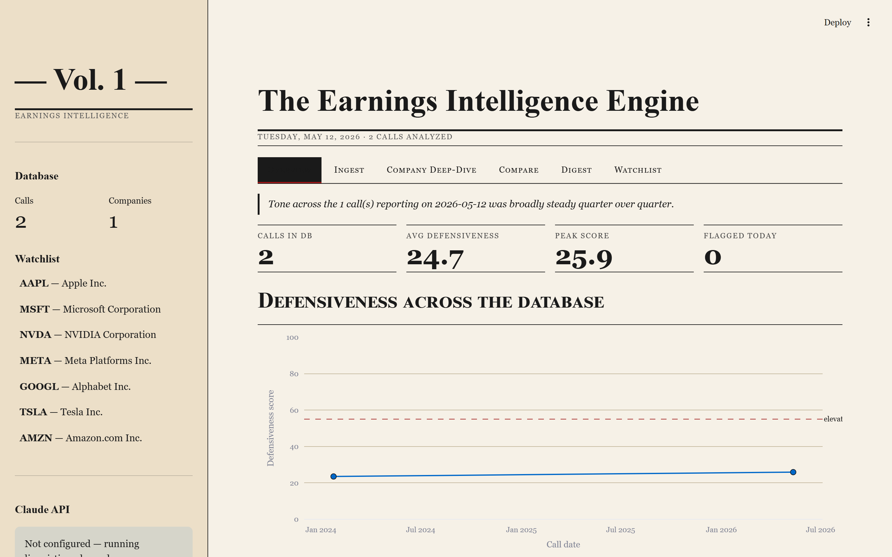
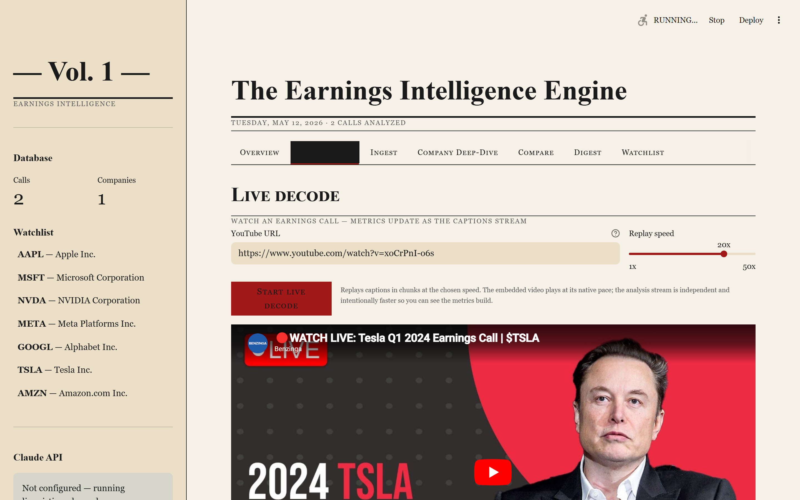
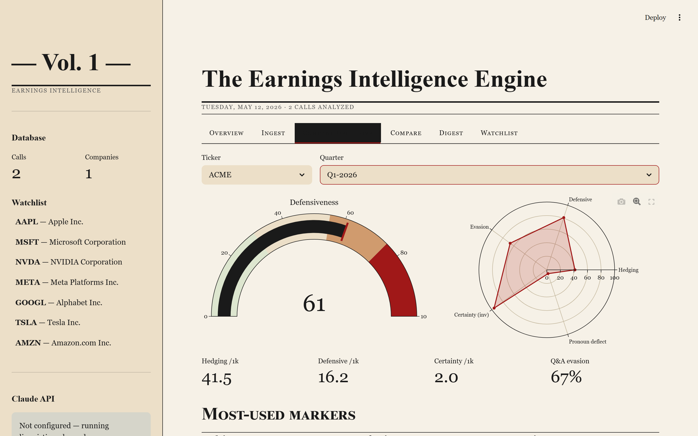

<div align="center">

# The Earnings Intelligence Engine

**Detect when CEOs go on the defensive.**

A research-grade pipeline that ingests earnings-call transcripts, measures hedging, defensive language, and Q&A evasion, and publishes a Grant's-style daily digest of the largest tone shifts — with a Streamlit dashboard that can **watch a YouTube earnings call live and update the analysis as it plays**.

[](https://www.python.org/)
[](LICENSE)
[](https://streamlit.io/)
[](https://www.anthropic.com/claude)

<br>



</div>

---

## Watch an earnings call live — see the analysis update as the captions stream

Paste a YouTube URL into the **Live Decode** tab. The dashboard embeds the video player, then independently replays the auto-captions in chunks. As each chunk arrives, the engine re-scores the running transcript — so you watch the defensiveness score, hedging density, and certainty markers move in real time while Elon Musk (or whoever) is still talking.

<video src="https://github.com/psygit202/Earnings-Call-Intel/raw/main/docs/screenshots/live_decode.webm" controls width="100%"></video>

> If the embedded video doesn't render in your browser, [download or view `docs/screenshots/live_decode.webm` directly](docs/screenshots/live_decode.webm).



**How it works under the hood.** YouTube auto-captions come with per-snippet timestamps. The Live Decode tab pulls them in one shot, then replays them at a configurable speed (1x to 50x), accumulating text and re-running the linguistic analyzer every ~120s of in-call time. The embedded YouTube player plays at native pace; the analysis stream is independent and intentionally faster so you can see the metrics build. No LLM, no GPU, no API key — just YouTube's free caption track and the deterministic linguistic engine.

---

## What it does

Earnings calls are scripted, but management's *language* leaks information the income statement doesn't. A CFO who hedged twice last quarter and twelve times this quarter is telling you something. The Earnings Intelligence Engine reads transcripts, counts the tells, and surfaces the biggest shifts.

- **Live decoding** — watch a YouTube earnings call and see hedging, defensiveness, and certainty metrics update as the captions stream. No API keys needed.
- **Deterministic linguistic engine** — ~120 markers across hedging (epistemic / probability / approximation / conditional), defensive phrases (reframing / non-answers / "great question" compliments), certainty language, and pronoun deflection. All counts normalized per 1,000 words.
- **Q&A evasion detection** — keyword-overlap distance between analyst questions and management answers. Low overlap → flagged as evasive, quoted verbatim in the digest.
- **Composite defensiveness score (0-100)** — weighted blend of all five components. A `FLAG` is raised when the score rises >25% quarter-over-quarter.
- **AI deep-analysis layer (optional)** — Claude Opus 4.7 classifies section tone, detects repeatedly-probed-but-avoided topics, compares narrative framing vs the prior quarter, and writes a 200-word QoQ tone narrative. Fully optional: works without an API key on linguistic counts alone.
- **Free-data ingestion** — YouTube auto-captions (no API key), generic web scraping, file upload (.txt/.pdf), or paste.
- **Grant's-style daily digest** — cream serif HTML + PDF, previewable in the dashboard.

---

## The three views that matter

### Overview — what shifted today


Masthead, KPI strip (call count, average score, peak score, flagged today), a defensiveness time series across every call in the database, and the recent-calls table.

### Company Deep-Dive — gauge, radar, transcript



Defensiveness gauge (0-100), a 5-component radar of the score ingredients, four metric cards, the most-used hedging / defensive / certainty phrases, the quoted evasive Q&A exchanges, and the full transcript with every marker highlighted in-place.

### Live Decode — watch the analysis update as the call plays


Embed an earnings-call YouTube video and stream the captions through the analyzer at adjustable speed. Metrics, a running trajectory chart, and a highlighted-text feed update every few seconds.

---

## Quickstart — 2 minutes

```bash
# 1. Clone
git clone https://github.com/psygit202/Earnings-Call-Intel.git
cd Earnings-Call-Intel

# 2. Install
pip install -r requirements.txt

# 3. Seed with REAL Tesla earnings data from YouTube (no API key needed)
python seed_real_demo.py --clear

# 4. Launch the dashboard
python -m streamlit run dashboard.py
# → open http://localhost:8501
```

Open the **Live Decode** tab, leave the default Tesla Q1 2024 URL, click **Start live decode**, and watch the metrics build. Or paste any other YouTube earnings call URL.

---

## Build a trading bot on Kalshi

This engine produces a per-call **defensiveness score (0-100)** and a quarter-over-quarter delta. That's the signal. To turn it into a trading bot on [Kalshi](https://kalshi.com) — the regulated US event-prediction-market exchange — you add three layers on top:

```
┌──────────────────────────────┐
│  Earnings Intel Engine       │  ← this repo. Outputs: defensiveness score, QoQ delta, narrative tone
└──────────────┬───────────────┘
               │
               ▼
┌──────────────────────────────┐
│  1. Signal rule              │  ← e.g. "score > 60 AND QoQ delta > +25%  →  short signal"
└──────────────┬───────────────┘
               │
               ▼
┌──────────────────────────────┐
│  2. Kalshi market mapper     │  ← map ticker + signal direction to a Kalshi event contract:
│                              │     • "Will $TSLA close down this week?"
│                              │     • "Will $NVDA implied vol > X% next 30d?"
│                              │     • "Will the S&P close negative on date X?"
└──────────────┬───────────────┘
               │
               ▼
┌──────────────────────────────┐
│  3. Kalshi API client        │  ← place orders, manage positions, exit on time-decay or
│                              │     pre-defined PnL target. Use Kalshi's REST API + webhooks.
└──────────────────────────────┘
```

**What you'd build on top of this repo**:

1. **`kalshi_client.py`** — thin wrapper around the Kalshi REST API (`api.elections.kalshi.com`). Handle auth, order placement, position queries.
2. **`signal_rules.py`** — the rule that turns `(defensiveness_score, qoq_delta, sector, market_cap)` into a trade direction and sizing. Start with a simple threshold rule; iterate after backtests.
3. **`market_mapper.py`** — given a ticker and direction, find the relevant Kalshi contract. Some tickers have direct stock-direction markets; others you'd map to broader index or vol markets.
4. **`backtest.py`** — replay historical earnings calls through the engine and check whether the score would have predicted next-day or next-week stock moves. **This is the most important piece** — the linguistic signal isn't validated against returns yet, and a Kalshi bot built on an unvalidated signal will lose money.
5. **`orchestrator.py`** — cron job: every weekday after market close, fetch new earnings call transcripts from your watchlist, run analysis, apply rules, place orders.

**What this repo gives you for free**:
- Reproducible, free transcript ingestion (YouTube)
- A composite tone score with five defensible components
- Quarter-over-quarter comparison logic
- Historical persistence (SQLite) so backtests are easy
- Optional Claude layer for second-opinion narrative analysis

**Honest caveats**:
- The score is a *signal candidate*, not a validated alpha factor. Backtest before you risk real money.
- Kalshi spreads on small-volume contracts can eat the entire edge — always factor in transaction costs.
- Earnings-tone signals work best at short horizons (1-5 trading days). Longer-horizon contracts pick up too much unrelated noise.
- Compliance is your responsibility. Kalshi is CFTC-regulated; check your jurisdiction and the platform's terms of use.

If you build this and it works, please open an issue and tell me about it.

---

## Try it on any YouTube video in 60 seconds

You don't need a paid data provider. **Any YouTube video with auto-captions works** — the engine pulls captions, falls back gracefully when there are no speaker labels, and scores the language directly.

1. Find a video. Earnings-call recordings are everywhere on YouTube (search *"NVIDIA earnings call Q3"*, *"Tesla earnings call"*, *"Apple earnings call"* — most large companies post officially). Or use any interview, press conference, or podcast.
2. Copy the URL.
3. Open the dashboard → **Live Decode** tab → paste the URL → set replay speed → **Start live decode**.

   Or: **Ingest** tab → **YouTube URL** → paste → **Pull captions** → **Ingest + analyze** to persist for QoQ comparison.

> **Caveat for non-earnings videos**: YouTube auto-captions have no speaker labels, so the parser falls back to treating the whole text as one block. You'll still get accurate hedging / defensive / certainty counts and a composite score — just not per-speaker breakdowns or Q&A evasion analysis.

---

## Configuration

### Optional: add your Claude API key

The deep-analysis layer (tone classification, topic-avoidance detection, narrative-shift report, QoQ narrative) calls the Claude API. Everything else runs offline.

```bash
cp .env.example .env
# Edit .env:
#   ANTHROPIC_API_KEY=sk-ant-...
#   ANTHROPIC_MODEL=claude-opus-4-7
```

Get a key at [console.anthropic.com](https://console.anthropic.com). Every Claude response is cached by transcript hash, so re-running the same transcript costs nothing.

If you don't set a key, the dashboard shows **"Not configured — running linguistic-only mode"** in the sidebar.

### Watchlist & markers

- [`config/tickers.yaml`](config/tickers.yaml) — watchlist
- [`config/linguistic_markers.yaml`](config/linguistic_markers.yaml) — 120+ markers; add your own

---

## Defensiveness score weighting

| Weight | Component                            |
|-------:|--------------------------------------|
| 30%    | Hedging-word density (per 1k words)  |
| 25%    | Defensive-phrase density             |
| 20%    | Q&A evasion rate                     |
| 15%    | Inverse of certainty-marker density  |
| 10%    | Pronoun deflection ratio             |

The `FLAG` badge is raised when a company's score rises **more than 25% quarter-over-quarter**.

---

## Architecture

```
fetch_transcripts ─┐
                   ├──▶ parse_transcript ──▶ linguistic_analyzer ──┐
                   │                                                 ├──▶ storage (SQLite)
                   └─────────────────────────▶ sentiment_engine ────┘             │
                                                (optional, Claude)                 ▼
                                                                          comparison_engine
                                                                                   │
                                                                                   ▼
                                                                           digest_generator
                                                                                   │
                                                                                   ▼
                                                                              dashboard.py
                                                                               (Streamlit)
                                                                                   │
                                                                                   ▼
                                                                          Live Decode tab
                                                                       (streaming caption replay)
```

| Module | Role |
|---|---|
| [`fetch_transcripts.py`](src/fetch_transcripts.py) | YouTube captions (full + snippet-by-snippet for streaming), web scraping, PDF/text upload |
| [`parse_transcript.py`](src/parse_transcript.py) | Speaker/role detection, section tagging, Q&A pair construction, unstructured-text fallback |
| [`linguistic_analyzer.py`](src/linguistic_analyzer.py) | Marker counts, pronoun ratios, Q&A evasion, composite score |
| [`sentiment_engine.py`](src/sentiment_engine.py) | Claude API: tone, topic avoidance, narrative shifts, guidance certainty. Optional. |
| [`comparison_engine.py`](src/comparison_engine.py) | QoQ deltas, top-5 shifts, FLAG rule |
| [`digest_generator.py`](src/digest_generator.py) | Jinja → cream-serif HTML → weasyprint PDF |
| [`storage.py`](src/storage.py) | SQLite schema and CRUD |
| [`dashboard.py`](dashboard.py) | Streamlit app with 7 tabs: Overview, **Live Decode**, Ingest, Company Deep-Dive, Compare, Digest, Watchlist |
| [`run_daily.py`](run_daily.py) | CLI: `ingest`, `analyze`, `compare`, `digest`, `watchlist`, `backfill`, `demo` |
| [`seed_real_demo.py`](seed_real_demo.py) | One-shot reproducible seed using real Tesla YouTube earnings calls |

---

## CLI reference

```bash
# Live decode is dashboard-only. CLI is for batch ingestion + analysis.
python run_daily.py ingest --url "https://www.youtube.com/watch?v=xoCrPnI-o6s" --ticker TSLA --quarter Q1-2024
python run_daily.py analyze --ticker TSLA --quarter Q1-2024
python run_daily.py compare --ticker TSLA
python run_daily.py digest --date 2024-04-23

# Reproducible demo with real Tesla YouTube data
python seed_real_demo.py --clear
```

---

## Testing

```bash
python -m unittest tests.test_analyzer -v
```

16 tests covering marker matching, pronoun analysis, Q&A evasion scoring, fixture metadata extraction, speaker/section detection, and the end-to-end property that the synthetic defensive fixture scores higher than the confident fixture on every relevant metric.

---

## Reproducing the demo artifacts

Every image and the WebM video are regenerable:

```bash
python seed_real_demo.py --clear
python -m streamlit run dashboard.py &
python docs/capture_screenshots.py        # 00_hero.png, 02_company_deepdive.png
python docs/capture_live_screenshot.py    # live_decode.png
python docs/record_live_video.py          # live_decode.webm
```

All four scripts use Playwright in headless mode against the running dashboard. Install: `pip install playwright && python -m playwright install chromium`.

---

## What's not in v1 (roadmap)

1. **Voice tone analysis from audio** — pair YouTube audio with a prosody model (pitch variance, speech rate, pause length).
2. **Peer benchmarking** — sector-relative baselines.
3. **Options-implied vol overlay** — correlate the composite score against the day-of straddle and next-day realized move.
4. **Kalshi bot scaffolding** — `kalshi_client.py`, `signal_rules.py`, `backtest.py`.
5. **Multi-quarter narrative arc** — detect drift across 8 quarters vs step-change.

---

## Notes on data sources and copyright

Auto-captions on YouTube are user-generated content that the YouTube API exposes for public consumption — pulling and analyzing them locally is the legal equivalent of taking notes while you watch the video. This project does not redistribute or rehost transcripts. Raw transcripts are stored under `data/transcripts/` and excluded from git via `.gitignore`. The committed fixtures under `tests/fixtures/` are fictional, written for this project.

If you point the engine at a copyrighted transcript source, you remain responsible for complying with that source's terms of use.

---

## License

MIT — see [LICENSE](LICENSE).

---

<div align="center">
<sub>Built as a study in how language reveals what the income statement won't.</sub>
</div>
