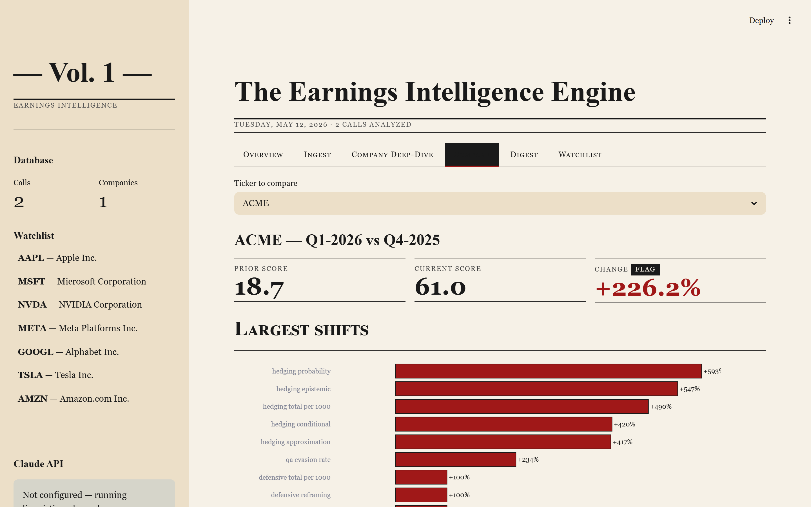
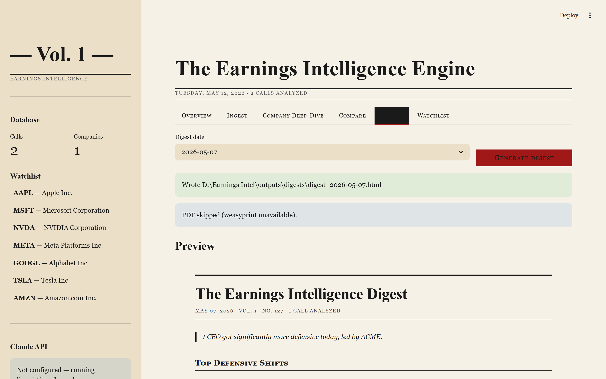
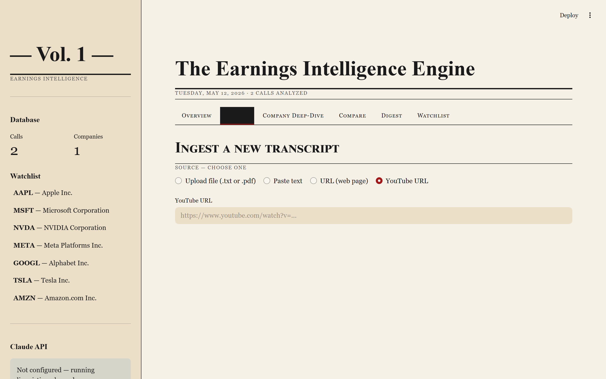

<div align="center">

# The Earnings Intelligence Engine

**Detect when CEOs go on the defensive.**

A research-grade pipeline that ingests earnings-call transcripts, measures hedging, defensive language, and Q&A evasion, and publishes a Grant's-style daily digest of the largest tone shifts — with a Streamlit dashboard for live exploration.

[](https://www.python.org/)
[](LICENSE)
[](https://streamlit.io/)
[](https://www.anthropic.com/claude)

<br>


</div>

---

## What it does

Earnings calls are scripted, but management's *language* leaks information the income statement doesn't. A CFO who hedged twice last quarter and twelve times this quarter is telling you something. The Earnings Intelligence Engine reads transcripts, counts the tells, and surfaces the biggest shifts in a daily digest.

- **Deterministic linguistic engine** — ~120 markers across hedging (epistemic / probability / approximation / conditional), defensive phrases (reframing / non-answers / "great question" compliments), certainty language, and pronoun deflection. All counts normalized per 1,000 words.
- **Q&A evasion detection** — keyword-overlap distance between analyst questions and management answers. Low overlap → flagged as evasive, quoted verbatim in the digest.
- **Composite defensiveness score (0-100)** — weighted blend of all five components. A `FLAG` is raised when the score rises >25% quarter-over-quarter.
- **AI deep-analysis layer (optional)** — Claude Opus 4.7 classifies section tone, detects repeatedly-probed-but-avoided topics, compares narrative framing vs the prior quarter, and writes a 200-word QoQ tone narrative. Fully optional: works without an API key, just on linguistic counts.
- **Free-data ingestion** — YouTube auto-captions (no API key), generic web scraping, file upload (.txt/.pdf), or paste.
- **Grant's-style daily digest** — cream serif HTML + PDF, exported to disk and previewable in the dashboard.

---

## Screenshots

### Company deep-dive — gauge, radar, metric cards, highlighted transcript


### Quarter-over-quarter comparison — the moment ACME's CEO started hedging



In the fictional demo, ACME's defensiveness rose **+226%** between Q4 2025 and Q1 2026. Every hedging subcategory spiked — probability words +593%, epistemic words +547%, total hedging +490%. That's the kind of pattern the engine is built to surface.

### Daily digest preview



### Ingest tab — pull captions straight from YouTube



---

## Quickstart (≈ 2 minutes)

```bash
# 1. Clone
git clone https://github.com/psygit202/Earnings-Call-Intel.git
cd Earnings-Call-Intel

# 2. Install
pip install -r requirements.txt

# 3. Seed the demo data (fictional ACME Q4-2025 + Q1-2026 transcripts)
python run_daily.py demo

# 4. Launch the dashboard
python -m streamlit run dashboard.py
# → open http://localhost:8501
```

That's it. The demo alone will show you the gauge, the +226% QoQ spike, the highlighted transcript, the digest preview, and the four flagged evasive exchanges.

---

## Try it on any YouTube video in 60 seconds

You don't need a paid data provider. **Any YouTube video with auto-captions works** — the engine pulls captions, falls back gracefully when there are no speaker labels, and scores the language directly.

### Step-by-step

1. Find a video. Earnings-call recordings are everywhere on YouTube (e.g. search *"NVIDIA earnings call Q3"*, *"Tesla earnings call"*, *"Apple earnings call"* — most companies post officially). Or use any interview, press conference, or podcast.
2. Copy the URL — e.g. `https://www.youtube.com/watch?v=dQw4w9WgXcQ`.
3. Open the dashboard → **Ingest** tab → select **YouTube URL**.
4. Paste the URL → **Pull captions**.
5. Fill in ticker and quarter (any string is fine — for non-earnings videos, use a label like `INTERVIEW-2026-05`).
6. Click **Ingest + analyze**.
7. Switch to the **Company Deep-Dive** tab → pick your label → see the defensiveness gauge and the transcript with every hedging word highlighted yellow, defensive phrases red, certainty markers green.

> **Caveat for non-earnings videos**: YouTube auto-captions have no speaker labels and no Q&A section, so the parser falls back to treating the whole text as one block. You'll still get accurate hedging / defensive / certainty counts and a composite score — just not the section-by-section or per-speaker breakdowns or Q&A evasion analysis. For real earnings calls posted as videos, the captions are usually clean enough that the metrics are meaningful comparatives.

### CLI equivalent

```bash
python run_daily.py ingest --url "https://www.youtube.com/watch?v=..." --ticker NVDA --quarter Q3-2026
python run_daily.py analyze --ticker NVDA --quarter Q3-2026
python run_daily.py digest --date 2026-05-12
```

---

## Configuration

### Optional: add your Claude API key

The deep-analysis layer (tone classification, topic-avoidance detection, narrative-shift report, QoQ narrative) calls the Claude API. Everything else runs offline.

```bash
cp .env.example .env
# Edit .env:
#   ANTHROPIC_API_KEY=sk-ant-...
#   ANTHROPIC_MODEL=claude-opus-4-7
```

Get a key at [console.anthropic.com](https://console.anthropic.com). Every Claude response is cached by transcript hash on disk under `data/cache/`, so re-running the same transcript costs nothing.

If you don't set a key, the dashboard will show **"Not configured — running linguistic-only mode"** in the sidebar and the AI checkbox on the Ingest tab will be disabled. Nothing else breaks.

### Watchlist

Edit [`config/tickers.yaml`](config/tickers.yaml) or use the **Watchlist** tab to add/remove tickers. Watchlist names get highlighted in the daily digest.

### Linguistic markers

All 120+ markers live in [`config/linguistic_markers.yaml`](config/linguistic_markers.yaml). Add your own phrases — the analyzer will pick them up on the next run.

---

## How the defensiveness score works

A weighted composite of five normalized components (each capped at 100):

| Weight | Component                            |
|-------:|--------------------------------------|
| 30%    | Hedging-word density (per 1k words)  |
| 25%    | Defensive-phrase density             |
| 20%    | Q&A evasion rate                     |
| 15%    | Inverse of certainty-marker density  |
| 10%    | Pronoun deflection ratio (they / (we + I)) |

The `FLAG` badge is raised when a company's score rises **more than 25% quarter-over-quarter**. The weighting is tuned against the bundled fixtures (a confident Q4 vs. a defensive Q1) but the marker file is yours to retune.

---

## Architecture

```
fetch_transcripts ─┐
                   ├──▶ parse_transcript ──▶ linguistic_analyzer ──┐
                   │                                                 ├──▶ storage (SQLite)
                   └─────────────────────────▶ sentiment_engine ────┘             │
                                                (optional, Claude)                 ▼
                                                                          comparison_engine
                                                                                   │
                                                                                   ▼
                                                                           digest_generator
                                                                            (HTML + PDF)
                                                                                   │
                                                                                   ▼
                                                                              dashboard.py
                                                                               (Streamlit)
```

### Module responsibilities

| Module | Role |
|---|---|
| [`fetch_transcripts.py`](src/fetch_transcripts.py) | YouTube captions, web scraping, PDF/text upload, manual paste |
| [`parse_transcript.py`](src/parse_transcript.py) | Speaker/role detection, section tagging, Q&A pair construction |
| [`linguistic_analyzer.py`](src/linguistic_analyzer.py) | Marker counts, pronoun ratios, Q&A evasion, composite score |
| [`sentiment_engine.py`](src/sentiment_engine.py) | Claude API: tone, topic avoidance, narrative shifts, guidance certainty. Cached, retried, schema-validated. Optional. |
| [`comparison_engine.py`](src/comparison_engine.py) | QoQ deltas, top-5 shifts, FLAG rule |
| [`digest_generator.py`](src/digest_generator.py) | Jinja → cream-serif HTML → weasyprint PDF |
| [`storage.py`](src/storage.py) | SQLite schema and CRUD |
| [`dashboard.py`](dashboard.py) | Streamlit app with 6 tabs: Overview, Ingest, Company Deep-Dive, Compare, Digest, Watchlist |
| [`run_daily.py`](run_daily.py) | CLI: `ingest`, `analyze`, `compare`, `digest`, `watchlist`, `backfill`, `demo` |

---

## CLI reference

```bash
# Ingest — pick one source
python run_daily.py ingest --file path/to/transcript.pdf --ticker AAPL --quarter Q1-2026
python run_daily.py ingest --url "https://investor.example.com/q4-2025-transcript"
python run_daily.py ingest --url "https://www.youtube.com/watch?v=..." --ticker NVDA --quarter Q4-2025
python run_daily.py ingest --paste --ticker TSLA --quarter Q1-2026

# Analyze (runs linguistic + optional Claude)
python run_daily.py analyze --ticker NVDA --quarter Q4-2025

# Compare the latest two quarters for a ticker
python run_daily.py compare --ticker NVDA

# Generate the digest (today or any past date)
python run_daily.py digest --date 2026-05-12

# Manage the watchlist
python run_daily.py watchlist --add MSFT --name "Microsoft Corporation"
python run_daily.py watchlist --list
python run_daily.py watchlist --remove MSFT

# Show which historical quarters you're missing
python run_daily.py backfill --ticker AAPL --quarters 8

# Reset to the bundled demo state
python run_daily.py demo
```

---

## Dashboard tour

### Overview
KPI strip (call count, average score, peak score, flagged today), a defensiveness time series with a dashed threshold at 55, and the recent-calls table.

### Ingest
Four source modes side by side: upload, paste, generic URL, YouTube URL. Auto-detects ticker/quarter/date from the text and lets you override. Optional "Run Claude deep analysis" checkbox.

### Company Deep-Dive
The richest view. A 0-100 defensiveness gauge, a 5-component radar of the score ingredients, four metric cards, three tables of the most-used hedging / defensive / certainty phrases, the quoted evasive Q&A exchanges, and the full transcript with markers highlighted in-place.

### Compare
Prior / current / Δ% cards (with the FLAG badge when triggered), a horizontal bar chart of the top-10 metric shifts (red = rise, ink = decline), and a sortable full delta table.

### Digest
Pick a date, click **Generate digest**, and the rendered HTML preview shows up inline. Download buttons for HTML and PDF.

### Watchlist
Add and remove tracked tickers — these get a special section in the daily digest.

---

## Testing

```bash
python -m unittest tests.test_analyzer -v
```

16 tests covering marker matching (case-insensitive, word-boundary, multi-word phrases), pronoun analysis, Q&A evasion scoring, fixture metadata extraction, speaker/section detection, and the end-to-end property that the defensive Q1 fixture scores higher than the confident Q4 fixture on every relevant metric. **All 16 pass.**

The fixture pair in [`tests/fixtures/`](tests/fixtures/) is the easiest way to retune the marker list: change weights, re-run tests, watch the score move.

---

## What's not in v1 (a.k.a. roadmap)

1. **Voice tone analysis from audio** — pair YouTube audio with a prosody model (pitch variance, speech rate, pause length). A CFO whose pitch variance rises 30% on guidance questions is a stronger signal than word counts alone.
2. **Peer benchmarking** — sector-relative baselines so a 40/1k hedging rate is interpreted relative to the sector mean. Software CFOs talk differently from oil & gas CFOs.
3. **Options-implied vol overlay** — correlate the composite score against the day-of straddle and next-day realized move. Turns the digest from a tone diary into a tradeable signal.
4. **Live alerting** — Slack webhook + SMTP, triggered by the `FLAG` rule.
5. **Multi-quarter narrative arc** — extend QoQ comparison to detect *drift* across 8 quarters versus a step-change. Different signals, different interpretations.

---

## Project layout

```
.
├── README.md
├── requirements.txt
├── .env.example
├── .gitignore
├── run_daily.py            ← CLI entry point
├── dashboard.py            ← Streamlit dashboard
├── .streamlit/
│   └── config.toml         ← cream + serif theme
├── config/
│   ├── tickers.yaml        ← Watchlist
│   └── linguistic_markers.yaml ← 120+ markers
├── src/
│   ├── storage.py
│   ├── fetch_transcripts.py
│   ├── parse_transcript.py
│   ├── linguistic_analyzer.py
│   ├── sentiment_engine.py
│   ├── comparison_engine.py
│   └── digest_generator.py
├── data/                   ← (gitignored) SQLite + cache + raw transcripts
├── outputs/digests/        ← (gitignored) generated HTML + PDF
├── logs/                   ← (gitignored)
├── docs/
│   ├── capture_screenshots.py  ← reproduce the README screenshots
│   └── screenshots/*.png
└── tests/
    ├── test_analyzer.py
    └── fixtures/
        ├── sample_acme_q4_2025.txt
        └── sample_acme_q1_2026.txt
```

---

## Contributing

This is a personal research project, but pull requests with new markers, better parsers for specific transcript sources, or new dashboard charts are welcome. If you ship a public deployment, drop me a note — I'd love to see it.

Style preferences:
- No emoji in code or files (the dashboard's aesthetic depends on this)
- Comments only when the *why* is non-obvious; code should be self-documenting
- Add a test in [`tests/test_analyzer.py`](tests/test_analyzer.py) for any new deterministic logic

---

## License

MIT — see [LICENSE](LICENSE).

The bundled sample transcripts in `tests/fixtures/` are fictional and were written for this project. They are not real earnings calls.

---

<div align="center">
<sub>Built as a study in how language reveals what the income statement won't.</sub>
</div>
